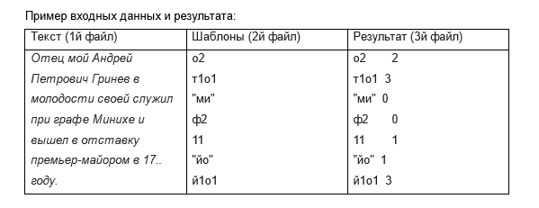

Приложение принимает в командной строке 3 имени файлов.

Первый файл – текст для анализа.

Второй файл – перечень шаблонов для поиска.

Третий файл – результаты.

Шаблоны поиска 2х видов имеют следующий формат:

а1б2в1 – означает, что слово должно одновременно содержать 1 букву «а», 2 буквы «б» и 1 букву «в»;

"абр" – означает, что слово должно содержать последовательность символов в кавычках (например, «швабра»).

В качестве результата, приложение выводит таблицу с количеством найденных в тексте слов по каждому шаблону.

Оценивается корректность работы приложения, производительность, оптимальность и качество кода. Многопоточная реализация приветствуется, но не обязательна.

